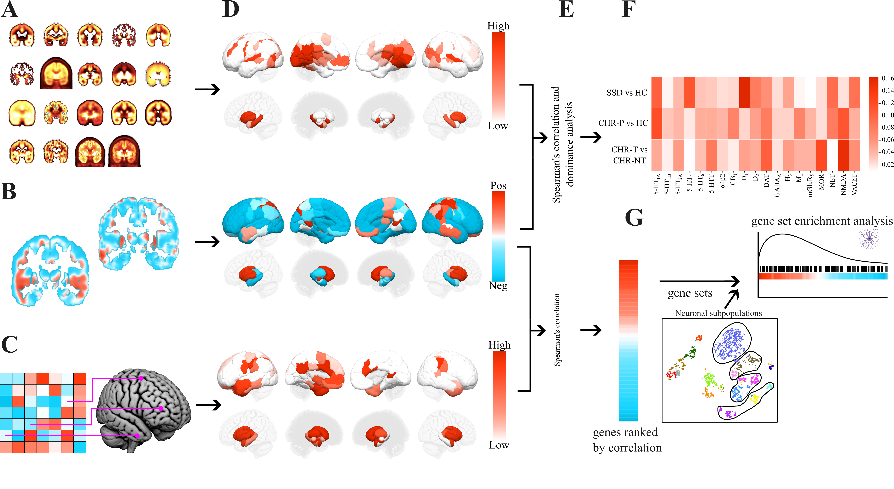

This work is licensed under [CC BY-NC-SA 4.0](https://creativecommons.org/licenses/by-nc-sa/4.0/?ref=chooser-v1). 

# Transcriptional and neurochemical signatures of cerebral blood flow alterations in schizophrenia and the clinical high-risk state for psychosis
This repository contains data and code used the project 'Transcriptional and neurochemical signatures of cerebral blood flow alterations in schizophrenia and the clinical high-risk state for psychosis', currently published as a preprint in [BioRIV](https://www.biorxiv.org/content/10.1101/2024.03.13.583894v1). The aim of this project is to measure the correspondence between regional cerebral blood flow alterations in the psychosis spectrum and molecular and neurochemical signatures as measured through the [Allen Human Brain Atlas](https://portal.brain-map.org) and [19 PET tracers](https://github.com/netneurolab/hansen_receptors/tree/main/data).

Code is written in Python.

Folders are described below.

## cbfreceptors

Analysis pipeline. **a**, 19 Group-level PET maps were obtained from [hansenreceptors](http://github.com/netneurolab/hansen_receptors). **b**, Group-level case-control rCBF t-stat maps (SSD vs HC, CHR-P vs HC) were calculated in SPM12. **c**, Gene expression data was obtained from the [Allen Human Brain Atlas (AHBA)](https://portal.brain-map.org). The AHBA tissue samples of donor brain images were registered to MNI space (ICBM152 nonlinear 2009c symmetric) using [Advanced Normalisation Tools](https://zenodo.org/records/3677132). The gene expression data, comprising a total of 17,205 genes, were then pre-processed and log-normalised29,30. **d**, PET, transcriptomic and case-control rCBF maps were then parcellated into 122 regions of interest (ROI) using standardised brain atlases27,28, with the mean value extracted for each region. Three example distributions (NMDA, CHR-P vs HC, PTPRZ1) are displayed in the figure for illustrative purposes. The resulting averaged distributions within each of the 122 ROIs for each marker (PET map, case-control rCBF map and gene expression map) were z-scored and then subjected to **e**, Spearman’s correlation to rank all PET maps and genes according to their association with each rCBF marker (SSD vs HC, CHR vs HC, CHR-T vs CHR-NT), and **f**, dominance analysis to ascertain the unique contribution of each PET map to rCBF phenotypes (SSD vs HC, CHR-P vs HC, CHR-T vs CHR-NT). **g**, Finally, gene set enrichment analyses were conducted to ascertain specific cell-types involved, using marker genes obtained from a recently published single-cell transcriptomic study from the human brain31 and filtered by differential stability to retain genes with Pearson’s ρ > 0.529. SSD, schizophrenia spectrum disorders. PET, positron emission tomography. CHR-P, clinical high-risk for psychosis. CHR-T, CHR-P individuals who subsequently transitioned to psychosis. CHR-NT, CHR-P individuals who had not transitioned at follow-up. HC, healthy control. MNI, Montreal Neurological Institute. rCBF, regional cerebral blood flow.

### `code`
The [code](code/) folder contains the code used to run the analyses. If you run this code ensure to change the path 
[parcellate_maps_and_generate_nulls](code/parcellate_maps_and_generate_nulls.npy)
This will parcellate (e.g. ASL, PET) .nii maps into a given atlas space (e.g. 2mm Schaefer+Xiao 122 ROI atlas). 
This code uses [neuromaps](https://netneurolab.github.io/neuromaps/usage.html) toolbox, PET maps from [hansenreceptors](https://github.com/netneurolab/hansen_receptors/tree/main/data), as well as group-level schizophrenia and clinical-high risk for psychosis rCBF t-stat maps we have made available for this project. After parcellating maps, nulls are generated using the [burt2020](https://brainsmash.readthedocs.io/en/latest/) method, implemented through [neuromaps](https://netneurolab.github.io/neuromaps/usage.html).

[analysis_correlations](code/analysis_correlations.npy)
This will run correlational analysis and generate a heatmap using the comparemaps function, implemented through [neuromaps](https://netneurolab.github.io/neuromaps/usage.html). 

[analysis_dominance](code/analysis_dominance.npy)
This will run a dominance analysis adapted from [hansenreceptors](https://github.com/netneurolab/hansen_receptors/tree/main/data) and implemented through [netneurotools](https://netneurotools.readthedocs.io/en/latest/).

[analysis_cooks_distance](code/analysis_cooks_distance.npy)
This will run a Cook's distance analysis of influential ROIs using [statsmodels](https://www.statsmodels.org/stable/index.html) and [scipy](https://scipy.org). 

### `data`
The [data](data/) folder contains the data used in the analysis including the parcellated data generated from the above code.
[atlas](data/atlas/) contains MNI152 atlases used for parcellation.
[pet_atlas](data/pet_atlas/) contains PET maps obtained from [hansenreceptors](https://github.com/netneurolab/hansen_receptors/tree/main/data).
[asl](data/asl/) contains group-level t-stat maps of rCBF arterial spin labelling case-control comparisions, calculated in [SPM12](https://www.fil.ion.ucl.ac.uk/spm/software/spm12/).

The clinical high risk (CHR-P) data was collected as part of two previous studies:
https://doi.org/10.1176/appi.ajp.2015.15040485
https://doi.org/10.1093/schbul/sbx169

The schizophrenia (SSD) data has been presented at these conferences:
https://cds.ismrm.org/protected/13MProceedings/PDFfiles/0736.PDF
https://cds.ismrm.org/protected/15MProceedings/PDFfiles/2368.pdf
    
Additional maps were created for those CHR-P that subsequently developed psychosis (CHR-T) and those two did not (CHR-NT), as well as maps including age, sex, medication as covariates in the analysis.
Participant information can be found in the Participant info table.
    
The supplementary materials document details scanning parameters and preprocessing.

receptors_parcellated and asl_parcellated .csv files contain asl and pet data that has been parcellated using the 82, 100, and 122 ROI atlases.
receptor_names_pet.npy contains a list of pet tracers used in this experiment.

Please refer to the [preprint](https://www.biorxiv.org/content/10.1101/2024.03.13.583894v1) and supplementary materials for a full list of references.

[saved_nulls](data/saved_nulls/) contains the null maps saved from 1. parcellate_maps_and_generate_nulls.

### `figures`
Contains figures generated through the above code.

brain render figures were generated through code in python by first extracting each ROI in MNI space using [nibabel](https://nipy.org/nibabel/) and converted to a mesh using [nii2mesh](https://github.com/neurolabusc/nii2mesh). Values for each ROI were input from .csv files finally each combined image was rendered in [surfice](https://www.nitrc.org/projects/surfice/).

### `results`
contains results generated through the above code.

## `transcriptomic analysis`
contains the code and data used for the transcriptomic analysis, implemented using the [imagingtranscriptomics](https://pypi.org/project/imaging-transcriptomics/) package.
